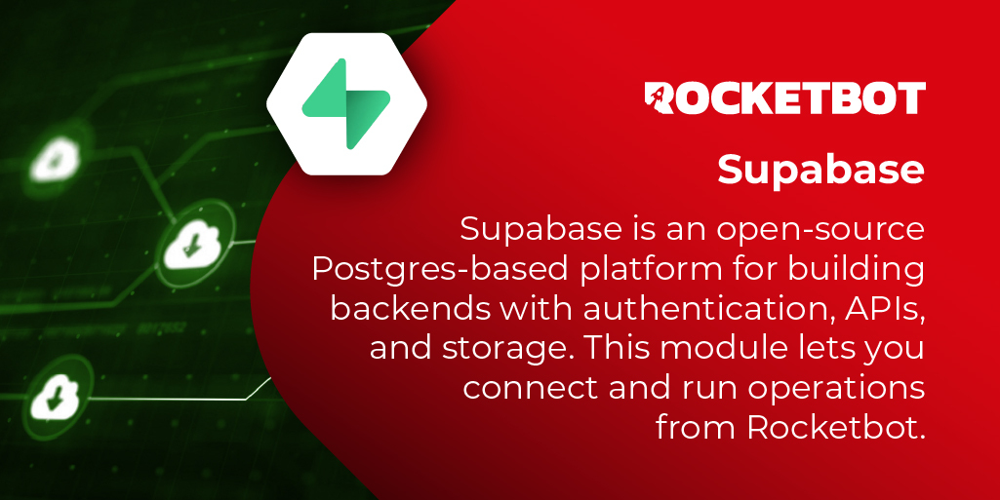

# Supabase

Supabase es una plataforma open-source basada en Postgres para construir backends con autenticación, APIs y storage. Este módulo permite conectarse y ejecutar operaciones desde Rocketbot.

*Read this in other languages: [English](Manual_Supabase.md), [Português](Manual_Supabase.pr.md), [Español](Manual_Supabase.es.md)*

## Como instalar este módulo

Para instalar el módulo en Rocketbot Studio, se puede hacer de dos formas:
1. Manual: __Descargar__ el archivo .zip y descomprimirlo en la carpeta modules. El nombre de la carpeta debe ser el mismo al del módulo y dentro debe tener los siguientes archivos y carpetas: \__init__.py, package.json, docs, example y libs. Si tiene abierta la aplicación, refresca el navegador para poder utilizar el nuevo modulo.
2. Automática: Al ingresar a Rocketbot Studio sobre el margen derecho encontrara la sección de **Addons**, seleccionar **Install Mods**, buscar el modulo deseado y presionar install.

## Como usar este modulo

Use este modulo para conectar Rocketbot con Supabase y ejecutar operaciones de base de datos, Storage, RPC y embeddings.

Uso basico:
1. Cree o seleccione un proyecto Supabase.
2. Copie el Project URL y una API key desde Supabase.
3. Ejecute Connect antes de usar los otros comandos.
4. Use los comandos de tablas para CRUD, los comandos de Storage para buckets/archivos y los comandos RPC para funciones Postgres.

API keys y RLS:
- Las API keys de Supabase identifican el componente de aplicacion que accede al proyecto. Por si solas no identifican al usuario final.
- Use preferentemente `sb_publishable_...` para contextos publicos/client-side. Es una clave de bajo privilegio y el acceso lo controlan las politicas RLS.
- Use `sb_secret_...` solo para automatizaciones backend seguras. Las secret keys tienen acceso elevado y pueden omitir RLS, por eso no deben exponerse en navegadores, repositorios publicos, logs, chats o URLs.
- Las claves legacy `anon` y 
`service_role` pueden seguir existiendo. Trate `anon` como acceso publicable y `service_role` como acceso secreto/backend.
- Si un comando falla por permisos, revise las politicas de la tabla, el rol permitido por la clave o use una clave backend solo cuando corresponda.

Comandos de embeddings:
Los comandos de embeddings son avanzados. Rocketbot genera embeddings y llama a Supabase, pero Supabase debe tener creados previamente los objetos necesarios para guardar y comparar vectores.

Flujo de uso:
1. Ejecute Connect.
2. Ejecute Embeddings Connect para guardar proveedor, API key y modelo por defecto.
3. En Supabase, cree una tabla compatible, por ejemplo `documents`.
4. Habilite la extension `vector` y cree una columna vectorial, por ejemplo `embedding vector(384)`. La dimension debe coincidir con la salida del modelo.
5. Cree una funcion RPC, por ejemplo `match_documents`, que reciba `query_embedding`, `match_threshold` y `match_count`, y compare vectores.
6. Ejecute Generate And 
Store Embedding para dividir texto, generar vectores e insertar las filas.
7. Ejecute Retrieve Documents para generar el embedding de consulta y llamar la funcion RPC.

Notas importantes:
- Supabase guarda embeddings usando Postgres y pgvector.
- La busqueda semantica compara significado, no palabras exactas.
- La funcion RPC pertenece al proyecto del cliente. Ajuste nombres de tablas, columnas, dimensiones, filtros y columnas de retorno segun el esquema del cliente.
- Para tablas grandes, agregue un indice vectorial. Supabase generalmente recomienda HNSW por rendimiento y robustez; IVFFlat existe para casos especificos.
- Si los documentos tienen permisos, aplique RLS o filtros de permisos en Supabase para que la busqueda vectorial devuelva solo filas permitidas.

Referencias:
- https://supabase.com/docs/guides/getting-started/api-keys
- https://supabase.com/docs/guides/ai
- https://supabase.com/docs/guides/ai/concepts
- https://supabase.com/docs/guides/ai/vector-columns
- 
https://supabase.com/docs/guides/ai/vector-indexes
- https://supabase.com/docs/guides/ai/semantic-search
- https://supabase.com/docs/guides/ai/rag-with-permissions

## Descripción de los comandos

### Conectar

Conecta con un proyecto Supabase y verifica que la API key tenga acceso.
|Parámetros|Descripción|ejemplo|
| --- | --- | --- |
|URL del proyecto|Direccion web del proyecto Supabase, por ejemplo https//project-ref.supabase.co.|https://<project-ref>.supabase.co|
|Clave de API|Clave de acceso de Supabase usada para autenticar las solicitudes al proyecto.|eyJhbGciOi...|
|Asignar resultado a variable|Nombre de la variable donde se guardara el resultado.|resultado|

### Obtener Tabla

Lee filas de una tabla Supabase, con orden opcional por created_at.
|Parámetros|Descripción|ejemplo|
| --- | --- | --- |
|Nombre de tabla|Nombre de la tabla de Supabase que se usara en este comando.|public.users|
|Ordenar por created_at (opcional)|Si esta activo, ordena los registros por la columna created_at.||
|Asignar resultado a variable|Nombre de la variable donde se guardara la lista de registros de la tabla. Si no hay registros, guarda una lista vacia [].|resultado|

### Filtrar Tabla

Lee filas de una tabla donde una columna coincide con el valor indicado.
|Parámetros|Descripción|ejemplo|
| --- | --- | --- |
|Nombre de tabla|Nombre de la tabla de Supabase que se usara en este comando.|public.users|
|Columna filtro|Nombre de la columna que se usara para filtrar registros.|id|
|Valor filtro|Valor que debe coincidir con la columna de filtro.|1|
|Asignar resultado a variable|Nombre de la variable donde se guardara la lista de registros filtrados. Si no hay coincidencias, guarda una lista vacia [].|resultado|

### Columnas (template)

Crea una plantilla JSON vacia usando las columnas detectadas en una tabla.
|Parámetros|Descripción|ejemplo|
| --- | --- | --- |
|Nombre de tabla|Nombre de la tabla de Supabase que se usara en este comando.|public.users|
|Asignar resultado a variable|Nombre de la variable donde se guardara el resultado.|resultado|

### Listar Columnas

Devuelve los nombres de columnas disponibles en una tabla.
|Parámetros|Descripción|ejemplo|
| --- | --- | --- |
|Nombre de tabla|Nombre de la tabla de Supabase que se usara en este comando.|public.users|
|Asignar resultado a variable|Nombre de la variable donde se guardara la lista de nombres de columnas, por ejemplo ["id", "nombre"].|resultado|

### Insertar Filas

Inserta una o mas filas en una tabla desde un array JSON.
|Parámetros|Descripción|ejemplo|
| --- | --- | --- |
|Nombre de tabla|Nombre de la tabla de Supabase que se usara en este comando.|public.users|
|Filas (JSON array)|Array JSON con una o mas filas. Cada objeto representa una fila.|[{"name":"Alfredo"}]|
|Asignar resultado a variable|Nombre de la variable donde se guardara el resultado.|resultado|

### Actualizar Filas

Actualiza una columna en filas seleccionadas por un filtro de igualdad.
|Parámetros|Descripción|ejemplo|
| --- | --- | --- |
|Nombre de tabla|Nombre de la tabla de Supabase que se usara en este comando.|public.users|
|Nombre de columna|Nombre de la columna que recibira el nuevo valor.|status|
|Valor|Nuevo valor que se asignara a la columna indicada.|active|
|Columna filtro|Nombre de la columna que se usara para filtrar registros.|id|
|Valor filtro|Valor que debe coincidir con la columna de filtro.|1|
|Asignar resultado a variable|Nombre de la variable donde se guardara el resultado.|resultado|

### Actualizar Multiples

Actualiza multiples filas desde un datatable JSON, usando id o una clausula WHERE.
|Parámetros|Descripción|ejemplo|
| --- | --- | --- |
|Nombre de tabla|Nombre de la tabla de Supabase que se usara en este comando.|public.users|
|Filas a actualizar (array JSON)|Array JSON con los datos a actualizar. Puede usar el id de cada fila o una condicion WHERE.|[{"id":1,"name":"X"}]|
|WHERE (opcional)|Clausula WHERE opcional para seleccionar registros cuando no se usa id por fila.|{"id":1}|
|Asignar resultado a variable|Nombre de la variable donde se guardara el resultado.|resultado|

### Borrar Filas

Elimina filas de una tabla donde una columna coincide con el valor indicado.
|Parámetros|Descripción|ejemplo|
| --- | --- | --- |
|Nombre de tabla|Nombre de la tabla de Supabase que se usara en este comando.|public.users|
|Columna filtro|Nombre de la columna que se usara para filtrar registros.|id|
|Valor filtro (valor o JSON array)|Valor que debe coincidir con la columna de filtro.|1|
|Asignar resultado a variable|Nombre de la variable donde se guardara el resultado.|resultado|

### Listar contenedores de archivos

Lista los buckets de Storage disponibles en el proyecto Supabase conectado.
|Parámetros|Descripción|ejemplo|
| --- | --- | --- |
|Asignar resultado a variable|Nombre de la variable donde se guardara la lista de nombres de contenedores de archivos, por ejemplo ["vault", "vault1"].|resultado|

### Crear contenedor de archivos

Crea un bucket de Storage y permite configurar visibilidad, limite y tipos MIME.
|Parámetros|Descripción|ejemplo|
| --- | --- | --- |
|Nombre del contenedor de archivos|Nombre del contenedor de archivos de Storage.|my-bucket|
|Publico|Indica si los archivos del contenedor seran publicos.||
|Limite de tamano de archivo (opcional)|Limite opcional de tamano de archivo, en bytes. Por defecto 10000000 bytes.|10000000|
|Tipos de archivo permitidos (opcional)|Tipos de archivo permitidos para subir al contenedor. Usar un array JSON, por ejemplo ["image/png", "image/jpeg", "application/pdf"]. Tambien puede usar text/plain, application/json o application/zip.|image/png,image/jpeg|
|Asignar resultado a variable|Nombre de la variable donde se guardara True si el contenedor de archivos se creo correctamente o False si no se pudo crear.|resultado|

### Obtener contenedor de archivos

Obtiene detalles de un bucket y opcionalmente lista sus archivos en la raiz.
|Parámetros|Descripción|ejemplo|
| --- | --- | --- |
|Nombre del contenedor de archivos|Nombre del contenedor de archivos de Storage.|my-bucket|
|Incluir archivos|Si esta activo, incluye los archivos ubicados en la carpeta principal del contenedor.||
|Asignar resultado a variable|Nombre de la variable donde se guardara el resultado.|resultado|

### Listar Archivos

Lista archivos de un bucket de Storage, con filtro opcional por path o prefijo.
|Parámetros|Descripción|ejemplo|
| --- | --- | --- |
|Contenedor de archivos|Nombre del contenedor de archivos de Storage.|my-bucket|
|Carpeta o prefijo (opcional)|Carpeta o comienzo de ruta opcional dentro del contenedor para filtrar archivos.||
|Asignar resultado a variable|Nombre de la variable donde se guardara la lista de archivos encontrados en el contenedor. Si no hay archivos, guarda una lista vacia [].|resultado|

### Subir Archivo

Sube un archivo local a un bucket de Storage, con object path y upsert opcionales.
|Parámetros|Descripción|ejemplo|
| --- | --- | --- |
|Contenedor de archivos|Nombre del contenedor de archivos de Storage.|my-bucket|
|Archivo local|Ruta del archivo local que se subira a Supabase.|C:/Users/Usuario/Desktop/archivo.png|
|Ruta destino del archivo (opcional)|Ruta del archivo dentro del contenedor de Storage.|folder/file.png|
|Actualizar o insertar si ya existe (opcional)|Si esta activo, reemplaza el archivo si ya existe en la misma ruta; si no existe, lo inserta.||
|Asignar resultado a variable|Nombre de la variable donde se guardara True si el archivo se subio correctamente o False si no se pudo subir.|resultado|

### Descargar Archivo

Descarga un objeto de Storage desde un bucket a una carpeta o ruta local.
|Parámetros|Descripción|ejemplo|
| --- | --- | --- |
|Contenedor de archivos|Nombre del contenedor de archivos de Storage.|my-bucket|
|Ruta del archivo en Supabase|Ruta del archivo dentro del contenedor de Storage.|folder/file.png|
|Carpeta destino local|Carpeta o ruta local donde se guardara el archivo descargado.|C:/Users/Usuario/Descargas|
|Asignar resultado a variable|Nombre de la variable donde se guardara True si el archivo se descargo correctamente o False si no se pudo descargar.|resultado|

### Ejecutar Funcion

Ejecuta una funcion RPC de Postgres en Supabase con parametros JSON opcionales.
|Parámetros|Descripción|ejemplo|
| --- | --- | --- |
|Nombre de funcion|Nombre de la funcion RPC/Postgres que se ejecutara en Supabase.|my_function|
|Parametros (objeto JSON)|Objeto JSON opcional con los parametros que recibira la funcion. Por defecto {}.|{}|
|Obtener respuesta completa de la API|Si esta activo, devuelve toda la respuesta de la funcion. Si no esta activo, devuelve solo el valor message cuando exista.||
|Asignar resultado a variable|Nombre de la variable donde se guardara el valor message devuelto por la funcion. Si Obtener respuesta completa de la API esta activo, guarda toda la respuesta.|resultado|

### Configurar busqueda semantica

Configura la API key del proveedor de embeddings y devuelve los modelos disponibles.
|Parámetros|Descripción|ejemplo|
| --- | --- | --- |
|Proveedor|Proveedor de embeddings que se configurara para generar vectores.||
|Clave de API|Clave de acceso del proveedor de embeddings.|...|
|Modelo de embeddings por defecto (opcional)|Modelo de embeddings por defecto que se usara si otros comandos no indican uno. Por defecto text-embedding-3-small.|text-embedding-3-small|
|Asignar resultado a variable|Nombre de la variable donde se guardara el resultado.|resultado|

### Generar vector de texto

Divide texto en fragmentos, genera embeddings e inserta los vectores en una tabla.
|Parámetros|Descripción|ejemplo|
| --- | --- | --- |
|Modelo de embeddings|Modelo usado para generar embeddings. Por defecto text-embedding-3-small.|text-embedding-3-small|
|Nombre de tabla|Nombre de la tabla de Supabase que se usara en este comando.|documents|
|Texto|Texto fuente que se procesara para generar embeddings.|text...|
|Tamano de fragmento (opcional)|Tamano maximo opcional de cada fragmento de texto. Por defecto 1024.|1024|
|Superposicion entre fragmentos (opcional)|Cantidad opcional de caracteres repetidos entre fragmentos consecutivos para conservar contexto. Por defecto 128.|128|
|Dimension del vector (opcional)|Dimension esperada del vector generado. Debe coincidir con el modelo y la columna vectorial. Por defecto 384.|384|
|Columna content (opcional)|Columna donde se almacenara el contenido de cada fragmento. Por defecto content.|content|
|Columna del vector (opcional)|Columna vectorial donde se almacenara el vector generado. Por defecto embedding.|embedding|
|Columna metadata (opcional)|Columna donde se almacenaran los datos adicionales de cada fragmento. Por defecto metadata.|metadata|
|Datos adicionales (objeto JSON)|Objeto JSON opcional con datos adicionales para guardar junto a cada fragmento. Por defecto {}.|{}|
|Asignar resultado a variable|Nombre de la variable donde se guardara el resultado.|resultado|

### Buscar Documentos

Genera un embedding de consulta y llama un RPC vectorial para buscar documentos.
|Parámetros|Descripción|ejemplo|
| --- | --- | --- |
|Modelo de embeddings|Modelo usado para generar embeddings. Por defecto text-embedding-3-small.|text-embedding-3-small|
|Nombre de funcion|Nombre de la funcion RPC/Postgres que se ejecutara en Supabase. Por defecto match_documents.|match_documents|
|Texto a buscar|Texto de consulta que se convertira en embedding para buscar documentos similares.|query...|
|Numero de resultados|Cantidad maxima de documentos similares a devolver. Por defecto 5.|5|
|Dimension del vector (opcional)|Dimension esperada del vector generado. Debe coincidir con el modelo y la columna vectorial. Por defecto 384.|384|
|Filtro (objeto JSON)|Objeto JSON opcional con filtros adicionales para la busqueda semantica. Por defecto {}.|{}|
|Umbral match (opcional)|Umbral opcional de similitud minimo para aceptar resultados. Por defecto 0.8.|0.8|
|Parametros RPC extra (objeto JSON)|Objeto JSON opcional con parametros extra que se enviaran a la funcion RPC. Por defecto {}.|{}|
|Obtener mas detalles|Si esta activo, devuelve toda la informacion encontrada, incluyendo id, metadata y similitud. Si no esta activo, devuelve solo el contenido de cada documento.||
|Asignar resultado a variable|Nombre de la variable donde se guardara la lista de contenidos encontrados. Si Obtener mas detalles esta activo, guarda toda la informacion devuelta por la busqueda.|resultado|

### Consultar nuevos registros

Consulta una tabla buscando filas con id mayor al ultimo id procesado.
|Parámetros|Descripción|ejemplo|
| --- | --- | --- |
|Tabla|Tabla que se consultara para detectar registros nuevos.|public.users|
|Ultimo id (opcional)|Ultimo id procesado. El comando devuelve filas con id mayor a este valor. Por defecto 0.|0|
|Asignar resultado a variable|Nombre de la variable donde se guardara el resultado.|resultado|
